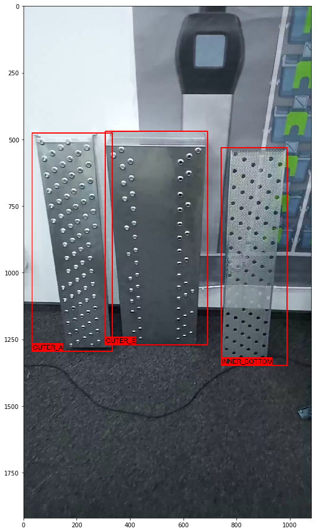

# 02. Object detection
This is the report about second task of CV course. The purpose of this task was to learn Google Object Detection API (OD API) and to perform end-to-end process of learning object detection model.
There next stages were performed:
1.  Manual annotation of train and test dataset;
2.  Input preparation for OD API;
3.  Training process in GCP;
4.  Postprocessing and verification.

For manual annotation [CVAT]( https://github.com/opencv/cvat) was used. It simplifies annotation process by interpolation between scenes and reduces count of manual operations. In results we have XML-file with description of boundary boxes and appropriated object-classes.
You can see annotated frame from test video in picture below

To convert clips to input for OD API there next steps were performed:
1.  From full dataset the one video for train (with annotation) and one video for validation (without annotation) were selected;
2.  All videos were splitted in frames and then every frame was matched to its annotation from XML-file [input-preparation.py](input_preparation.py). In result the TFRecord file was prepared for each video.
3.  The configuration file was created for train process. The Faster RCNN model with coefficients pretrained in COCO dataset was used for initialization. 
4.  The local checks was performed in [Docker-image](Dockerfile)

The training process took 80K epochs and ~ 4 hours in 5 standard GPU-worker. The cost was ~ $30.
As the final model the last checkpoint in iteration 82508 was took. The evaluation in validation video was performed in local machine [postprocessing.py](postprocessing.py). The model performed forecast for every frame in video, after that the frames with boundary boxes were drawn and concataned in new video. The resulted video clip was converted to GIF using ffmpeg.

